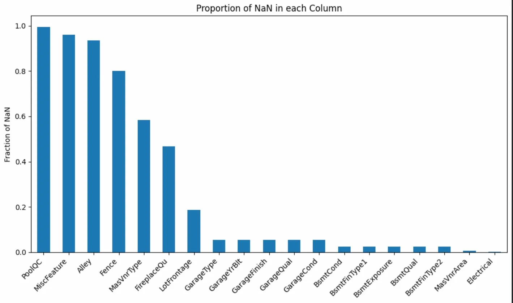
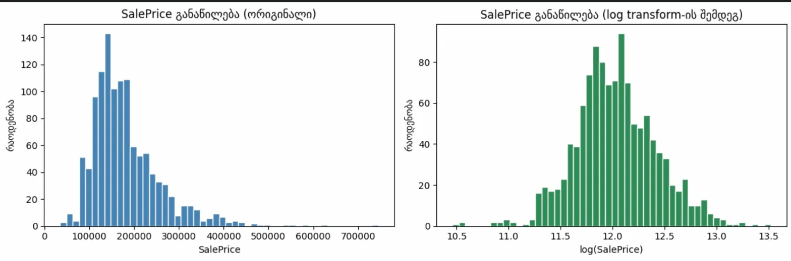

# house-prices-ML-assignment1
## კონკურსის მიმოხილვა

House Prices კონკურსის მიზანია სახლების ფასების პროგნოზირება სხვადასხვა მოცემული მახასიათებლების საფუძველზე. ამოცანა ფასდება (Root-Mean-Squared-Error)-ის ლოგარითმის მიხედვით predicted და რეალურ ფასებს შორის.


## მიდგომა
ეს ამოცანა სათაურის მიხედვით და ისედაც, ცხადია, რომ რეგრესიის ამოცანაა რადგან სახლის ფასები რიცხვების უწყვეტ ინტერვალზეა. შესაბამისად უნდა გამოვიყენოთ რეგრესიის მოდელები. ამისთვის თავიდან უნდა დავამუშაოთ შემოსული data. თავიდან ვყოფ data-ს 80/20 train და test ად. EDA- ფაზაში ვნახულობ ზოგადად data-ს თვისებებს, ასევე ვნახულობ თუ რამდენი სვეტია ისეთი რომელსაც ბევრი NaN მნიშვნელობა აქვს და შესაბამისად ვექცევი მონაცემებს (Cleaning & Preprocessing). შემდეგი ფაზაა Feature Engineering-ი სადაც ახალი ცვლადები შემომაქვს და რამდენიმე ძველ ცვლადებს გადავყრი. ასევე ამ ფაზაში ვიყენებ ისეთ მეთოდებს რითიც, კატეგორიულ ცვლადებს რიცხვითში გარდავქმნი, რადგან ეს საჭიროა, რომ რეგრესიის მოდელებმა იმუშაონ. შემდეგ მოდის Feature Selection -ფაზა სადაც რამდენიმე მეთოდი მაქვს რითიც მნიშვნელოვან ცვლადებს ამოვარჩევ. და საბოლოოდ მოდის ტრენინგის და ექსპერიმენტების ფაზა, სადაც ვტესტავ რამდენიმე რეგრესიის მოდელს, ვუკეთებ მათ თავიანთ pipeline-ებს და ვლოგავ mlflow -თი dagshub-ზე.

## რეპოზიტორიის სტრუქტურა

```
house-prices-ml/
├── house-prices-model-experiment.ipynb    ← EDA, data cleaning, feature engineering, ექსპერიმენტები
├── house-prices-model-inference.ipynb     ← საუკეთესო მოდელის ჩამოტვირთვა და submission
└── README.md
```
## ფაილების აღწერა

| ფაილი | აღწერა |
|-------|--------|
| `house-prices-model-experiment.ipynb` | ნოუთბუქი მონაცემების დამუშავებისთვის და ექსპერიმენტებისთვის |
| `house-prices-model-inference.ipynb` | საუკეთესო მოდელის ჩამოტვირთვა და kaggle-სთვის submission-ის შექმნა |
| `README.md` | პროექტის დოკუმენტაცია |


## მონაცემთა დამუშავება / გაწმენდა (Data preprocessing / cleaning )
### 1. NaN მნიშვნელობიანი სვეტების დამუშავება.
EDA -ს ფაზის შემდეგ, სადაც დატასეტი დავყავი ორად, train-ად და test-ად, train-ში მოვძებნე ისეთი სვეტები, რომლებსაც NaN მნიშვნელობები ჰქონდათ.



მიუხედავად იმისა, რომ ზოგიერთ დატასეტში NaN - ნიშნავს, რომ ეს თვისება უბრალოდ missing არის, ამ დატასეტში ზოგიერთი სვეტების NaN-ები ნიშნავს იმას, რომ სახლს უბრალოდ ეს თვისება არ აქვს. კეგლის data_description.txt შევამოწმე და ასეთი feature-ები იყო:

| სვეტი | მიზეზი |
|-------|--------|
| `GarageType`, `GarageFinish`, `GarageQual`, `GarageCond` | სახლს გარაჟი არ აქვს |
| `BsmtQual`, `BsmtCond`, `BsmtExposure`, `BsmtFinType1`, `BsmtFinType2` | სახლს სარდაფი არ აქვს |
| `PoolQC` | აუზი არ აქვს |
| `FireplaceQu` | ბუხარი არ აქვს |
| `Fence` | ღობე არ აქვს |
| `Alley` | გვერდითი შესასვლელი არ აქვს |
| `MiscFeature`, `MasVnrType` | შესაბამისი feature არ აქვს |

ამგვარი კატეგორიული სვეტები შევავსე უბრალოდ სტრინგი "None" -თი

| სვეტი | მიზეზი |
|-------|--------|
| `GarageYrBlt` | გარაჟი არ აქვს, ამიტომ აშენების წელი = 0 |

ასეთი რიცხვითი სვეტები კი უბრალოდ 0 ით შევავსე. 

### 2. ნამდვილად missing სვეტების შევსება.

დანარჩენი feature-ები კი, მაგალითად (`LotFrontage`, `MasVnrArea`, `Electrical`), რომელიც ზედა გრაფიკის მიხედვით შეიცავენ NaN-ებს, ნამდვილად დაკარგულია/არ არის აღრიცხული.

- SimpleImputer -ის გამოყენებით LotFrontage და MasVnrArea - რომლებიც, რიცხვითი სვეტებია, შევავსე მედიანით, რადგან ის უფრო მდგრადია outlier-ების მიმართ. 

- ხოლო კატეგორიული ცვლადის ('Electrical') NaN -ები - უბრალოდ შევავსე მოდით, ანუ ყველაზე ხშირი მნიშვნელობით. (აქაც SimpleImputer-ით).

## Feature Engineering

### 1. ახალი სვეტების შექმნა 

არსებული სვეტებიდან შევქმენი ახალი, უფრო ინფორმაციული feature-ები:

**ფართობის სვეტები:**
- `TotalSF` = `TotalBsmtSF` + `1stFlrSF` + `2ndFlrSF` — სახლის მთლიანი ფართობი
- `TotalPorchSF` = ყველა Porch-ის ფართობის ჯამი
- `BsmtFinTotal` = `BsmtFinSF1` + `BsmtFinSF2` — Finished სარდაფის ფართობი

**აბაზანის სვეტი:**
- `TotalBath` = `FullBath` + `BsmtFullBath` + `0.4×HalfBath` + `0.4×BsmtHalfBath` — სრული აბაზანა ალბათ უფრო მეტად ფასდება ამიტომ 0.4 ზე გავამრავლე პატარა აბაზანები.

**ასაკის სვეტები:**
- `HouseAge` = `YrSold` - `YearBuilt` — სახლის ასაკი გაყიდვის მომენტში
- `RemodelAge` = `YrSold` - `YearRemodAdd` — რემონტიდან გასული დრო

**ახალი სვეტები**
- `HasGarage` — აქვს თუ არა გარაჟი
- `HasBasement` — აქვს თუ არა სარდაფი
- `HasPool` — აქვს თუ არა აუზი
- `Has2ndFloor` — აქვს თუ არა მეორე სართული
- `WasRemodeled` — ჩაუტარდა თუ არა რემონტი

ამ ახალი სვეტების შექმნის შემდეგ, ის სვეტები რაც მათ შესაქმნელად გამოვიყენე, წავშალე რათა თავიდან ამერიდებინა collinear-ულობა ცვლადებს შორის. რეალურად ისინი აღარ იყო საჭირო.

შესაბამისად გადავყარე სვეტები: `1stFlrSF`, `2ndFlrSF`, `OpenPorchSF`, `EnclosedPorch`, `3SsnPorch`, `ScreenPorch`, `FullBath`, `HalfBath`, `BsmtFullBath`, `BsmtHalfBath`, `BsmtFinSF1`, `BsmtFinSF2`, `YearBuilt`, `YearRemodAdd`

            
---

### 2. Ordinal Encoding 

- **data_description.txt**-ზე შეხედვით აქაც შევამჩნიე ერთი რამ: ზოგიერთ სვეტებს ბუნებრივი თანმიმდევრობა ჰქონდათ. მაგალითად ისეთი ცვლადები, რომლებიც ხარისხს ასახავდნენ ჰქონდათ შემდეგი კატეგორიული მნიშვნელობები: None (არ აქვს), Po (Poor), Fa (Fair), TA (Average), Gd (Good), Ex (Excellent).
- ასეთი სვეტებისთვის One Hot Encoding -ი უბრალოდ ზედმეტი იქნებოდა რადგან თითოეული ასეთი Feature-სთვის 6 - ცალ ახალ სვეტს დაამატებდა. ამიტომ ესეთი სვეტები ('GarageQual', 'GarageCond', 'PoolQC', 'ExterQual', 'ExterCond', 'BsmtCond', 'HeatingQC', 'KitchenQual', 'BsmtQual', 'FireplaceQu') გარდავქმენი უბრალოდ შესაბამისი რიცხვებით, რომლებიც ხარისხს ბუნებრივად ასახავენ.

**ახალი Qual მნიშვნელობები**
- 'None' - 0, `Po` — 1, `Fa` — 2, `TA` — 3, `Gd` — 4, `Ex` — 5.

- მსგავსი ტიპის სვეტები იყო: ('GarageFinish', 'PavedDrive', 'Functional', 'LandSlope'). მათაც თავიანთი მიმართებები ჰქონდათ, რაც ზედა ცვლადების მსგავსად რიცხვითებით შევცვალე შესაბამისად.

---

### 3. One Hot Encoding 

დარჩენილი კატეგორიული სვეტები კი რიცხვითში გარდავქმენი **One Hot Encoding** - ის გამოყენებით, რომლებიც უბრალოდ ახალ სვეტებს ამატებს 0/1 მნიშვნელობებით, იმის შესაბამისად, აქვს თუ არა ეს feature- შესაბამის სახლს.

---

## Feature Selection

### 1. Correlation Filter

კორელაციის ფილტრის საშუალებით ამოვარჩიე ისეთი სვეტების წყვილები, რომლებს შორის კორელაცია 0.85-ზე მეტი იყო(აქ რამდენიმე threshold- ვცადე და საბოლოოდ ამაზე შევჩერდი, რადგან არ მინდოდა ზედმეტი სვეტების გადაყრა. ამ შემთხვევაში შეიძლება ისეთი სვეტები გადაეყარა რაც ნამდვილად საჭირო გამოდგებოდა და მოდელი ვეღარ ისწავლიდა ნამდვილ დამოკიდებულებებს. შესაბამისად გვექნებოდა underfiting-ი. არც ზედმეტად მაღალი ავირჩიე რაც ბევრ კორელირებულ სვეტს დატოვებდა და overfitted გამოვიდოდა).ასეთი სვეტები ერთმანეთთან ძალიან ძლიერადაა დაკავშირებული და მოდელისთვის ერთსა და იმავე ინფორმაციას ატარებენ. თუ წყვილები 0.85 ზე მეტადაა კორელირებული, ერთს ვშლი და იმას ვტოვებ რომელსაც დანარჩენებთან ნაკლები კორელაცია აქვს.

> შედეგად: თუ საწყის 244 სვეტს გავუკეთებთ ამ ფილტრს **29 სვეტი წაიშალება**. დარჩება **215 სვეტი**.

---

### 2. Recursive Feature Elimination (RFE)

RFE იყენებს Ridge რეგრესიას როგორც estimator-ს (alpha=10 ჰიპერპარამეტრით რეგულარიზაციისთვის) და თანდათან აკლებს ყველაზე სუსტ სვეტებს, სანამ სასურველ რაოდენობას არ მიაღწევს.

> შედეგად: ამ შემთხვევაში კორელაციის ფილტრის შემდეგ, RFE 215 სვეტიდან ტოვებს **80 საუკეთესო სვეტს**.

---

### ტრენინგი და ექსპერიმენტები
გამოვიყენე სამი ძირითადი მოდელი: **Linear Regression**(სხვადასხვა ჰიპერპარამეტრებით რეგულარიზაციისთვის), **Decision Tree Regression**, **Random Forest Regression**, რომლებიც Dagshub-ზე MLFlow -თი დავლოგე. ასევე ყველა მოდელს თავისი Pipeline გავუკეთე, რაც ერთად preprocessing_pipeline ექსპერიმენტში დავლოგე.

-- თითოეული მოდელისთვის დავლოგე შემდეგი მეტრიკები:

| მეტრიკა | აღწერა |
|---------|--------|
| `train_r2` | R² სკორი train სეტზე (cross-validation) |
| `val_r2` | R² სკორი validation სეტზე (cross-validation) |
| `train_rmse` | RMSE train სეტზე (დოლარებში) |
| `train_rmsle` | RMSLE train სეტზე |
| `test_rmse` | RMSE test სეტზე (დოლარებში) |
| `test_r2` | R² სკორი test სეტზე |
| `test_rmsle` | RMSLE test სეტზე |

### 1. Linear Regression (Without Regularization, Ridge, Lasso)


პირველ რიგში სანამ წრფივი რეგრესიის შედეგებზე გადავიდოდე, EDA-ს ფაზაში შევხედე Salesprices- ანუ იგევე Y სვეტს და აღმოჩნდა, რომ ფასების განაწილება Skewed- იყო. ამას წრფივ მოდელზე შეიძლება ცუდი შედეგი მოეტანა ამიტომ მთლიანად გავალოგარითმე, რაც განაწილებას უახლოვებს ნორმალურ განაწილებას, რაც სასარგებლო იქნება წრფივი მოდელებისთვის. დანარჩენი მოდელებისთვის ეს საჭირო არ არის. 

შევამოწმე შემდეგი კომბინაციები:
- **Ridge**: alpha = 1, 10, 50, 100, 500, 1000, 5000, 10000
- **Lasso**: alpha = 0.0005, 0.001, 0.002, 0.005, 0.01, 0.1, 1.0
- **LinearRegression**: რეგულარიზაციის გარეშე

- Filters: Correlation Filter და RFE.

### Linear Regression შედეგები (დალაგებული test_rmsle-ით)
| Name | train_r2 | val_r2 | test_r2 | test_rmse | test_rmsle |
|------|----------|--------|---------|-----------|------------|
| **Lasso(α=0.001)** | 0.9369 | 0.8584 | 0.9403 | $21,400 | **0.1189** |
| Lasso(α=0.002) | 0.9347 | 0.8572 | 0.9397 | $21,502 | 0.1192 |
| Lasso(α=0.0005) | 0.9375 | 0.8587 | 0.9397 | $21,514 | 0.1193 |
| Ridge(α=50) | 0.9365 | 0.8673 | 0.9401 | $21,430 | 0.1197 |
| Ridge(α=10) | 0.9376 | 0.8613 | 0.9391 | $21,619 | 0.1199 |
| Ridge(α=1) | 0.9377 | 0.8591 | 0.9384 | $21,729 | 0.1200 |
| Ridge(α=100) | 0.9345 | 0.8713 | 0.9396 | $21,523 | 0.1200 |
| LinearRegression | 0.9377 | 0.8589 | 0.9384 | $21,744 | 0.1200 |
| Lasso(α=0.005) | 0.9272 | 0.8560 | 0.9343 | $22,449 | 0.1213 |
| Ridge(α=500) | 0.9156 | 0.8729 | 0.9216 | $24,523 | 0.1277 |
| Lasso(α=0.01) | 0.9141 | 0.8547 | 0.9201 | $24,754 | 0.1300 |
| Ridge(α=1000) | 0.8919 | 0.8597 | 0.8932 | $28,621 | 0.1393 |

აქ მოდელებს მცირე overfit აქვთ val და train მეტრიკებს თუ შევადარებთ.

**Underfitted მოდელები (ძლიერი regularization):**
| Name | train_r2 | val_r2 | test_r2 | test_rmse | test_rmsle |
|------|----------|--------|---------|-----------|------------|
| Ridge(α=5000) | 0.7223 | 0.7102 | 0.6918 | $48,619 | 0.2145 |
| Lasso(α=0.1) | 0.6932 | 0.6872 | 0.6502 | $51,800 | 0.2357 |
| Ridge(α=10000) | 0.5701 | 0.5621 | 0.5307 | $59,996 | 0.2691 |
| Lasso(α=1.0) | 0.0000 | -0.0013 | -0.0158 | $88,271 | 0.4332 |

ეს ალფა ჰიპერპარამეტრები დავამატე იმისთვის, რომ მეჩვენებინა მაღალი penalty-ს გავლენა underfit- ing-ზე. ცხადია ესენი underfitted მოდელებია (ქვედა ნაწილი). Lasso α = 1-ს კი საერთოდ train-ში R2 მეტრიკი 0 აქვს, ანუ მაღალი რეგულარიზაციის გამო ისეთი underfitted- მოდელი გამოდის, რომ საერთოდ ვერ ხსნიან feature-ები ფასების ვარიაციას. Ridge-ს α = 5000 მიუხედავად იმისა, რომ overfit -არ აქვს, მისი test მეტრიკი მაინც ძალიან მაღალია და ჩავთვალე რომ underfitted- არის.

---

### 2. Decision Tree Regression 

* აქ ბევრი ჰიპერპარამეტრების გასატესტად გამოვიყენე **GridSearchCV**, რამაც მომცა საშუალება სხვადასხვა ჰიპერპარამეტრის კომბინაციით გამეტესტა მოდელები.
* 7 ცალი **max_depth**-ი და 5 ცალი **min_samples_leaf**- ით მივიღე 35 კომბინაცია.

### Decision Tree შედეგები (top 5 best + top 5 worst) CF და RFE ფილტრების გარეშე

**საუკეთესო მოდელები:**

| Name | train_r2 | val_r2 | test_r2 | test_rmse | test_rmsle |
|------|----------|--------|---------|-----------|------------|
| **DT(depth=20, leaf=8)** | 0.9024 | 0.7730 | 0.8310 | $36,002 | **0.1836** |
| DT(depth=None, leaf=10) | 0.8927 | 0.7781 | 0.8334 | $35,742 | 0.1836 |
| DT(depth=20, leaf=10) | 0.8927 | 0.7781 | 0.8334 | $35,742 | 0.1836 |
| DT(depth=15, leaf=10) | 0.8927 | 0.7781 | 0.8334 | $35,742 | 0.1836 |
| DT(depth=10, leaf=10) | 0.8921 | 0.7785 | 0.8334 | $35,742 | 0.1836 |

საუკეთესო შედეგი მიიღო **DT(depth=20, leaf=8)**-მა, თუმცა წრფივ მოდელებს მნიშვნელოვნად ჩამორჩება.train_r2=0.9024 vs val_r2=0.7730 დაახლოებით 0.13-იანი სხვაობაა, რაც მიუთითებს overfitting-ზე. ერთი ხე ადვილად იზეპირებს train data-ს. ასევე depth=None და depth=20 თითქმის იდენტურ შედეგს იძლევა, რაც თითქოს გვეუბნება რომ 20 სიღრმე უკვე საკმარისია მონაცემების "ზეპირად" ასათვისებლად.

**Underfitted მოდელები (დაბალი სიღრმე):**

| Name | train_r2 | val_r2 | test_r2 | test_rmse | test_rmsle |
|------|----------|--------|---------|-----------|------------|
| DT(depth=2, leaf=2) | 0.6668 | 0.6503 | 0.6610 | $50,995 | 0.2686 |
| DT(depth=2, leaf=5) | 0.6668 | 0.6503 | 0.6610 | $50,995 | 0.2686 |
| DT(depth=2, leaf=8) | 0.6668 | 0.6503 | 0.6610 | $50,995 | 0.2686 |
| DT(depth=2, leaf=10) | 0.6668 | 0.6503 | 0.6610 | $50,995 | 0.2686 |
| DT(depth=2, leaf=15) | 0.6668 | 0.6503 | 0.6610 | $50,995 | 0.2686 |

აქაც როგორც წრფივ რეგრესიაში ცუდ შედეგიან მოდელებზე overfit- არ ქვაქვს, მაგრამ ამ მოდელებში underfit გვაქვს, რაც ბუნებრივიც არის და ლოგიკურიც ვინაიდან 2 სიღრმის ხე არ ყოფნის ამდენი მონაცემის მიხედვით სახლის ფასის მიხვედრას. ასევე `min_samples_leaf` პარამეტრს პრაქტიკულად გავლენა არ აქვს depth=2-ზე.

### Decision Tree შედეგები (top 5 best + top 5 worst) CF და RFE ფილტრებით

**საუკეთესო მოდელები:**

| Name | train_r2 | val_r2 | test_r2 | test_rmse | test_rmsle |
|------|----------|--------|---------|-----------|------------|
| **DT(depth=10, leaf=5)** | 0.8583 | 0.7324 | 0.8036 | $38,810 | **0.2045** |
| DT(depth=10, leaf=15) | 0.7820 | 0.7302 | 0.7688 | $42,115 | 0.2093 |
| DT(depth=None, leaf=15) | 0.7820 | 0.7302 | 0.7687 | $42,118 | 0.2093 |
| DT(depth=20, leaf=15) | 0.7820 | 0.7302 | 0.7687 | $42,118 | 0.2093 |
| DT(depth=15, leaf=15) | 0.7820 | 0.7302 | 0.7687 | $42,118 | 0.2093 |

**Underfitted მოდელები (depth=2):**

| Name | train_r2 | val_r2 | test_r2 | test_rmse | test_rmsle |
|------|----------|--------|---------|-----------|------------|
| DT(depth=2, leaf=2) | 0.6235 | 0.6059 | 0.6645 | $50,731 | 0.2840 |
| DT(depth=2, leaf=5) | 0.6235 | 0.6059 | 0.6645 | $50,731 | 0.2840 |
| DT(depth=2, leaf=8) | 0.6235 | 0.6059 | 0.6645 | $50,731 | 0.2840 |
| DT(depth=2, leaf=10) | 0.6235 | 0.6059 | 0.6645 | $50,731 | 0.2840 |
| DT(depth=2, leaf=15) | 0.6235 | 0.6059 | 0.6645 | $50,731 | 0.2840 |

CF + RFE ფილტრებმა Decision Tree-ს შედეგები გააუარესა (`$38,810` vs `$35,742`). ეს იმაზე მიუთითებს რომ feature selection ხელს უშლის Decision Tree-ს — ხეს სჭირდება მეტი feature-ი განტოტვისას, RFE-მა კი 215-დან 80-მდე შეამცირა ისინი.

---
### 3. Random Forest Regression

* აქაც გამოვიყენე **GridSearchCV**, რითიც გავტესტე 3*4*3*3 = 108 კომბინაცია (3 ცალი **n_estimators**, 4 ცალი **max_depth**, 3 ცალი **min_samples_leaf**, 3 ცალი **max_features**)

### Decision Tree შედეგები (top 4 best + top 4 worst) CF და RFE ფილტრების გარეშე

**საუკეთესო მოდელები:**

| Name | train_r2 | val_r2 | test_r2 | test_rmse | test_rmsle |
|------|----------|--------|---------|-----------|------------|
| **RF(n=300, depth=None, feat=0.3, leaf=2)** | 0.9654 | 0.8589 | 0.8865 | $29,510 | **0.1503** |
| RF(n=200, depth=10, feat=0.5, leaf=2) | 0.9634 | 0.8591 | 0.8875 | $29,380 | 0.1504 |
| RF(n=200, depth=20, feat=0.3, leaf=2) | 0.9650 | 0.8596 | 0.8870 | $29,439 | 0.1504 |
| RF(n=200, depth=None, feat=0.3, leaf=2) | 0.9649 | 0.8597 | 0.8867 | $29,482 | 0.1505 |

**ყველაზე ცუდი მოდელები:**

| Name | train_r2 | val_r2 | test_r2 | test_rmse | test_rmsle |
|------|----------|--------|---------|-----------|------------|
| RF(n=100, depth=None, feat=0.7, leaf=6) | 0.9178 | 0.8450 | 0.8670 | $31,943 | 0.1559 |
| RF(n=100, depth=15, feat=0.7, leaf=6) | 0.9178 | 0.8451 | 0.8670 | $31,943 | 0.1559 |
| RF(n=100, depth=20, feat=0.7, leaf=6) | 0.9178 | 0.8450 | 0.8670 | $31,943 | 0.1559 |
| RF(n=100, depth=10, feat=0.7, leaf=6) | 0.9178 | 0.8458 | 0.8624 | $32,488 | 0.1572 |


საუკეთესო Random Forest მოდელმა მიიღო `test_rmsle=0.1503`, რაც Decision Tree-ს (`0.1836`) მნიშვნელოვნად სჯობს, თუმცა წრფივ მოდელებს (`0.1189`) მაინც ჩამორჩება. `max_features=0.3` საუკეთესო აღმოჩნდა, რაც ალბათ იმის გამოა, რომ ხეებს შორის მრავალფეროვნება იზრდება და ensemble უკეთ მუშაობს. პირიქით, `max_features=0.7` ყველაზე ცუდ შედეგს იძლევა, რადგან ხეები ერთმანეთს ემსგავსება და ensemble-ს სარგებელი მცირდება. `min_samples_leaf=6` ასევე ცუდ შედეგს გვაძლევს, რადგან ზედმეტი regularization ხელს უშლის სწავლას. საინტერესოა რომ depth-ის შეზღუდვა (`depth=10, 15, 20`) depth=None-ს პრაქტიკულად არ სჯობს, რაც RF-ის ძირითად უპირატესობაზე მიუთითებს, bagging-ის გამო ღრმა ხეების გაშუალება overfitting-ს თავისთავად ანეიტრალებს.

### Decision Tree შედეგები (top 4 best + top 4 worst) CF და RFE ფილტრებით

**საუკეთესო მოდელები:**

| Name | train_r2 | val_r2 | test_r2 | test_rmse | test_rmsle |
|------|----------|--------|---------|-----------|------------|
| **RF(n=300, depth=20, feat=0.3, leaf=2)** | 0.9268 | 0.8141 | 0.8495 | $33,973 | **0.1706** |
| RF(n=300, depth=None, feat=0.3, leaf=2) | 0.9270 | 0.8142 | 0.8491 | $34,020 | 0.1708 |
| RF(n=200, depth=None, feat=0.3, leaf=2) | 0.9268 | 0.8139 | 0.8476 | $34,195 | 0.1709 |
| RF(n=200, depth=15, feat=0.3, leaf=2) | 0.9254 | 0.8141 | 0.8474 | $34,208 | 0.1715 |

**ყველაზე ცუდი მოდელები:**

| Name | train_r2 | val_r2 | test_r2 | test_rmse | test_rmsle |
|------|----------|--------|---------|-----------|------------|
| RF(n=100, depth=15, feat=0.7, leaf=6) | 0.8491 | 0.7869 | 0.8257 | $36,560 | 0.1802 |
| RF(n=300, depth=15, feat=0.7, leaf=6) | 0.8498 | 0.7867 | 0.8230 | $36,849 | 0.1803 |
| RF(n=300, depth=None, feat=0.7, leaf=6) | 0.8498 | 0.7867 | 0.8227 | $36,876 | 0.1804 |
| RF(n=300, depth=20, feat=0.7, leaf=6) | 0.8498 | 0.7867 | 0.8227 | $36,876 | 0.1804 |


CF + RFE ფილტრებმა აქაც, შედეგები გააუარესა (`$33,973` vs `$29,510`). ეს იმავე მიზეზს უკავშირდება რაც Decision Tree-ებში, Random forest-ს feature-ების სიმრავლე სჭირდება განშტოებების დივერსიფიკაციისთვის, RFE-მა კი 215-დან 80-მდე შეამცირა. `max_features=0.3` კვლავ საუკეთესოა 2 ფოთლით, `max_features=0.7` 6 ფოთლით კი ყველაზე ცუდი. ეს დასკვნა ფილტრების გარეშე ექსპერიმენტსაც ემთხვევა. ჩანს რომ, RF-ისთვის feature selection არ არის საჭირო. პირიქით გვიფუჭებს შედეგებს.

---
### საუკეთესო მოდელის შერჩევა და kaggle - ის შედეგი

* საუკეთესო მოდელი ავირჩიე წრფივი მოდელებიდან. მიუხედავად იმისა, რომ მცირე განსხვავება იყო val და test-ს შორის რაც მიუთითებს მცირე overfitting-ზე, საუკეთედსო შედეგები test-ში მაინც წრფივმა მოდელებმა დადეს რეგულარიზაციით. ალბათ houseprice-ს გალოგარითმება ძალიან კარგი მიდგომა აღმოჩნდა, რის გამოც წრფივმა მოდელებმა დიდი უპირატესობა მოიპოვეს სხვა მოდელებთან შედარებით. მოდელი შევარჩიე test_rmlse -ს მიხედვით


ყველა run დარეგისტრირებულია: [DagShub-ზე](https://dagshub.com/ZukaCS/house-prices-ML-assignment1)

თითოეულ run-ში დაილოგა:
* ყველა მოდელი თავისი ჰიპერპარამეტრებით
* ზემოთ ნახსენები მეტრიკები
* დატრენინგებული მოდელის არტეფაქტი

ასევე შექმნილია ცალკე run სადაც თითოეული მოდელის **pipeline** არის დალოგილი.


